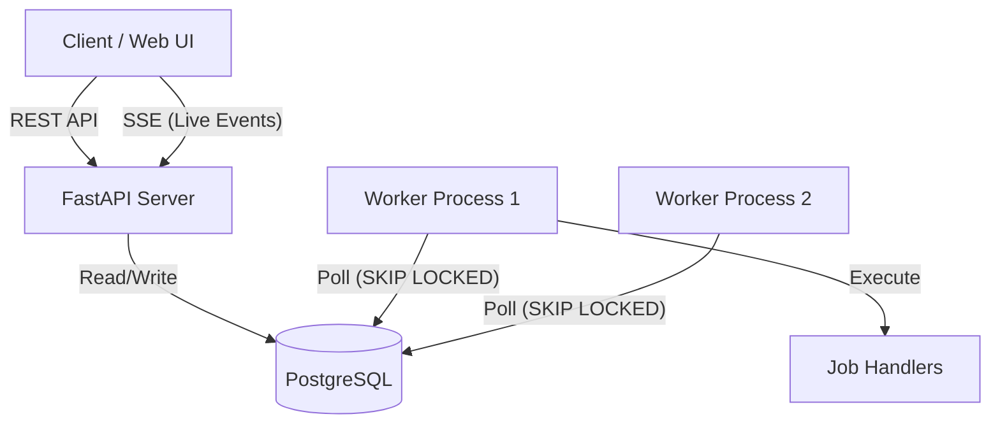

# Background Job Scheduler — System Architecture

A production-grade background job scheduler with worker processes, exponential backoff retries, Dead Letter Queue (DLQ) management, DAG workflows, and a live monitoring dashboard.

---

## 1. System Overview

The system consists of three main components:
1. **FastAPI Web Server**: Exposes REST API endpoints for job submission, workflow creation, status checks, and streams live updates using Server-Sent Events (SSE).
2. **PostgreSQL Database**: Serves as the persistent state store and queue coordinator. Row-level locking guarantees safe concurrent operations.
3. **Background Worker(s)**: Independent processes that continuously poll the database, manage priorities, and execute jobs concurrently.



---

## 2. Database Schema

The persistence layer uses three tables to manage jobs, dependencies, and audit trails:

### `jobs` Table
Tracks the configuration and execution state of every job.
* `id` (UUID, Primary Key): Unique job identifier.
* `type` (String): Type of job (e.g., `send_email`, `generate_report`, `upload_file`).
* `payload` (JSON): Parameters required for job execution.
* `priority` (Integer): Base priority (1 = High, 2 = Medium, 3 = Low).
* `effective_priority` (Float): Dynamically calculated priority to prevent starvation.
* `status` (Enum): Lifecycle status (`pending`, `processing`, `completed`, `failed`, `cancelled`).
* `retry_count` (Integer): Number of execution attempts completed.
* `max_retries` (Integer): Maximum retries permitted (default: 3).
* `error_message` (Text): Details of the last failure.
* `scheduled_at` (DateTime with timezone): Future timestamp for scheduled runs.
* `interval` (String): Recurring interval configuration (`every_1_minute`, `every_5_minutes`, `every_1_hour`).
* `is_in_dlq` (Boolean): Dead Letter Queue flag.
* `worker_id` (String): Identifier of the worker process handling the job.
* `started_at` / `completed_at` (DateTime with timezone): Timestamps for execution analysis.
* `next_retry_at` (DateTime with timezone): Backoff execution watermark.

### `job_dependencies` Table
Represents directed dependencies between jobs (DAG edges).
* `id` (UUID, Primary Key): Unique relationship identifier.
* `job_id` (UUID, Foreign Key): The downstream job that is blocked.
* `depends_on_job_id` (UUID, Foreign Key): The upstream job that must complete first.

### `job_logs` Table
Maintains a complete audit log of all events in the system.
* `id` (UUID, Primary Key): Unique log identifier.
* `job_id` (UUID, Foreign Key): Target job.
* `event` (String): Event type (`created`, `started`, `retry`, `failed`, `completed`, `cancelled`).
* `message` (Text): Human-readable event details.
* `details` (JSON): Extensible event metadata (errors, run durations, outputs).

---

## 3. Scheduler Algorithms & Benchmarks

The system implements two scheduling algorithms to evaluate trade-offs:
1. **Min-Heap (Priority Queue)**: Sorts jobs by `(effective_priority, scheduled_at, created_at)`. Ensures strict priority ordering.
2. **Timing Wheel**: An alternative bucket-based cyclic queue designed for ultra-high throughput O(1) scheduling.

### Benchmark Results
Both schedulers were benchmarked across insertion, extraction, and mixed workloads:

| Operation | Jobs | Heap | Timing Wheel | Winner |
|-----------|------|------|-------------|--------|
| Insert | 1,000 | 14.91 ms | 11.76 ms | Wheel |
| Extract | 1,000 | 10.94 ms | 5.15 ms | Wheel |
| Mixed | 1,000 | 20.58 ms | 8.94 ms | Wheel |
| Insert | 10,000 | 85.11 ms | 43.88 ms | Wheel |
| Extract | 10,000 | 93.76 ms | 28.78 ms | Wheel |
| Mixed | 10,000 | 155.08 ms | 56.84 ms | Wheel |
| Insert | 100,000 | 1.460 s | 1.263 s | Wheel |
| Extract | 100,000 | 3.001 s | 536.06 ms | Wheel |
| Mixed | 100,000 | 2.343 s | 714.88 ms | Wheel |

### Recommendation
* **Timing Wheel** wins in sheer raw processing speed and O(1) time complexity.
* **Min-Heap** is chosen for our production scheduler because **strict priority ordering** is a primary requirement. A Min-Heap guarantees that a High-Priority (1) job is always executed before a Low-Priority (3) job.

---

## 4. Worker Lifecycle & Concurrency Control

To support multiple worker processes running concurrently, the worker utilizes PostgreSQL row-level locks:

```sql
SELECT * FROM jobs 
WHERE status = 'pending' 
  AND (scheduled_at IS NULL OR scheduled_at <= NOW())
  AND (next_retry_at IS NULL OR next_retry_at <= NOW())
ORDER BY effective_priority ASC, scheduled_at ASC, created_at ASC
LIMIT 10
FOR UPDATE SKIP LOCKED;
```

* `FOR UPDATE`: Locks the fetched rows.
* `SKIP LOCKED`: If another worker has already locked a row, skip it immediately without waiting.
This prevents race conditions and ensures that a job is processed by **exactly one** worker.

---

## 5. Advanced Features

### Starvation Prevention
To prevent low-priority (Priority 3) jobs from being permanently blocked by a continuous stream of high-priority (Priority 1) jobs, the system uses dynamic priority boosting:
$$\text{effective\_priority} = \text{priority} - \left( \frac{\text{waiting\_time\_seconds}}{\text{STARVATION\_BOOST\_INTERVAL}} \right)$$
* If a low-priority job (base 3) waits for 120 seconds (with `STARVATION_BOOST_INTERVAL = 60`), its effective priority boosts to `3 - 2 = 1.0`, placing it on equal footing with high-priority jobs.

### DAG Workflow Engine
Jobs can form Directed Acyclic Graphs (DAGs) using index-based dependencies.
* **Cycle Prevention**: The API validates that dependency chains do not form cycles during workflow creation using topological validation.
* **Execution**: Downstream jobs remain in `pending` status until all of their parent dependencies transition to `completed`.

### Exponential Backoff & Dead Letter Queue (DLQ)
When a job handler fails:
1. The system increments `retry_count`.
2. If `retry_count < max_retries`, a retry is scheduled using exponential backoff with random jitter:
   $$\text{delay} = 5^{(\text{attempt}-1)} + \text{uniform}(0, 0.5 \times 5^{(\text{attempt}-1)})$$
   * Attempt 1: ~1s
   * Attempt 2: ~5s
   * Attempt 3: ~25s
3. If all attempts are exhausted, the job transitions to `failed` and is marked `is_in_dlq = true`.
4. If the number of jobs in the DLQ exceeds the threshold (e.g., 10), a critical alarm is triggered in the logs.
